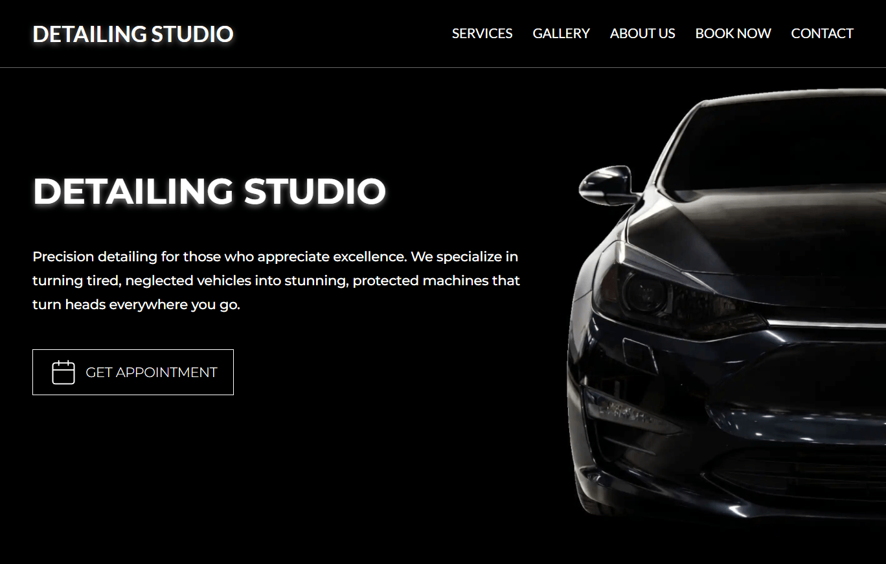
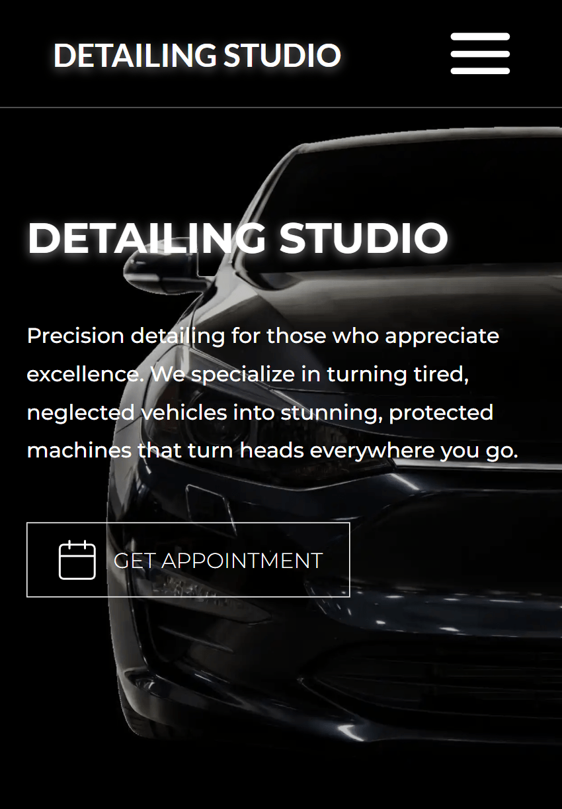
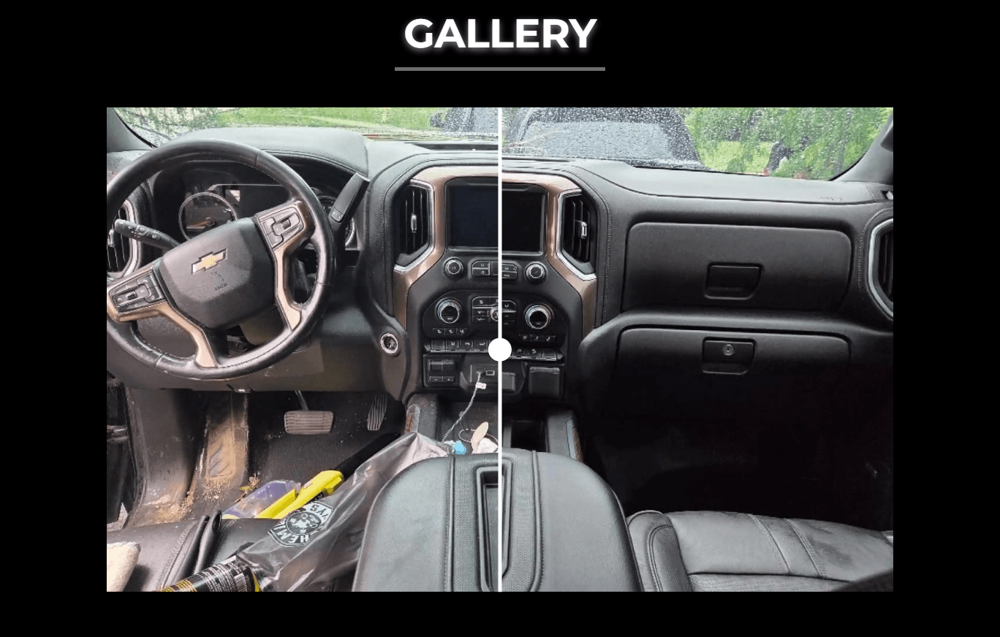
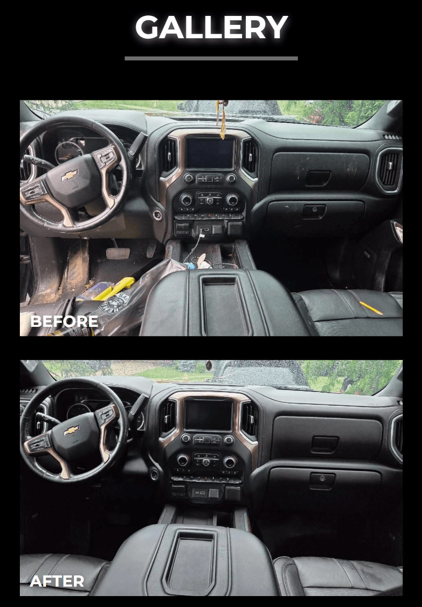

###### _HERO_
## Detailing Studio Website

Website for a car detailing business. Focused on performance, responsiveness, and clear service presentation.

---

###### _PROJECT OVERVIEW_
## Landing page for a detailing studio

Landing page for a car detailing studio. Includes a service overview, before/after gallery, and booking call-to-actions. Performance metrics are in the Performance section.

---

###### _LIVE DEMO_
### Experience the live application at: [Detailing Studio](https://detailing-studio-xi.vercel.app/)

---

###### _SCREENSHOTS_
## Visual presentation

|             DESKTOP              |              MOBILE              |
|:--------------------------------:|:--------------------------------:|
|  |  |
|  |  |
|  |  |

---

###### _FEATURES_
## Core features and layout

- **Custom Before/After Gallery:** Interactive slider for comparing before and after detailing results.
- **Dark Aesthetic:** Dark, minimal UI.
- **Responsive Design:** Responsive layout across all viewport sizes, including a mobile navigation menu.
- **Assets Optimization:** Preloading, lazy loading, and responsive image sizes for fast load times.
- **Structured Service Cards:** Service and pricing information presented in cards.
- **Direct Call-to-Action:** "Book Now" touchpoints placed throughout the page to guide users toward the booking flow.

---

###### _PERFORMANCE_
## Lighthouse and Core Web Vitals

Lighthouse scores (mobile and desktop):
- **Performance:** 100/100
- **Accessibility:** 95/100
- **Best Practices:** 100/100
- **SEO:** 92/100

Core Web Vitals (CWV):
- **LCP** at 288ms
- **CLS** at 0.0
- **FCP** at 244ms
- **TTFB** at 60ms

These numbers indicate a very fast, stable, and well-optimized experience for users. A CLS of 0.0 indicates no layout shift during load.

---

###### _TECH STACK_
## Web Technologies

- **Framework:** Vue.js
- **Bundler:** Vite
- **Language:** JavaScript
- **Styling:** SCSS
- **Deployment:** Vercel

---

###### _PROJECT STRUCTURE_
## Repository organization
```text
├── public/
├── screenshots/
├── src/
|   ├── assets/
|   ├── components/
|   ├── data/
|   ├── router/
|   ├── seo/
|   ├── styles/
|   ├── views/
|   ├── App.vue
|   └── main.js
└── index.html
```

---

###### _INSTALLATION_
## Local setup

1. Clone the repository.
```bash
git clone https://github.com/LG2GAME/detailing-studio.git
```

2. Install dependencies.
```bash
npm install
```

3. Start the local development server.
```bash 
npm run dev
```

4. Open the site in your browser.
```bash 
http://localhost:5173
```

---

###### _DEVELOPMENT_
## Running the project locally

Common workflow:
- Edit content and sections in the source code.
- Check the site across multiple viewport sizes.
- Validate spacing, typography, and interaction states.
- Review accessibility and SEO metadata before release.

---

###### _BUILD_
## Production build
To create a production-ready build, run:

```bash
npm run build
npm run start
```

---

###### _ARCHITECTURE_
## Frontend structure and design approach
The architecture prioritizes maintainability, modularity, and content clarity.

**Project principles:**
- **Component-Driven UI (Vue + Vite):** Section-based layout with shared UI elements including cards and buttons.
- **Styling (SCSS + BEM):** Component-scoped styles following BEM naming conventions.
- **Static Content:** Data is hardcoded. No CMS or API dependency (yet).
- **Accessibility:** Semantic HTML5 with ARIA attributes. Lighthouse score: 95.

---

###### _SEO_
## Search visibility foundation
Lighthouse SEO score: 92. 

**Core SEO implementations:**
- **Semantic Structure:** HTML5 sectioning tags and logical heading hierarchy for easy crawling.
- **Optimized Metadata:** Descriptive titles, meta descriptions, and Open Graph previews.
- **Asset Optimization:** WebP format with alt text on all images.
- **Local SEO:** Keywords targeting local detailing search queries.
- **Sitemap:** Auto-generated for search engine indexing.

---

###### _ACCESSIBILITY_
## Inclusive user experience
Lighthouse accessibility score: 95.

**Core accessibility implementations:**
- **Keyboard Navigation:** Full support for tab-based browsing and clear interactive focus states.
- **ARIA & Labels:** ARIA attributes and descriptive labels on interactive elements.
- **Visual Contrast:** Contrast typography ensuring optimal readability for all users.
- **Semantic Landmarks:** HTML5 structural landmarks and a logical heading hierarchy.
- **Touch targets**: Sized to meet minimum accessibility guidelines.

---

###### _PROJECT STATUS_
## Current state
The project is complete and deployed. Metrics are documented in the Performance section.

---

###### _ROADMAP_
## Planned improvements

Potential next steps for future development:
- Mobile-first refactor
- Fluid UI animations
- TypeScript migration
- Multi-page expansion

---

###### _LICENSE_
Copyright (c) 2026 Arkadiusz Górszczyk.

All rights reserved. This project and its source code are for demonstration and portfolio purposes only.

Unauthorized copying, distribution, modification, or commercial use of this project, including its design and code architecture, via any medium is strictly prohibited without prior written permission from the author.

---